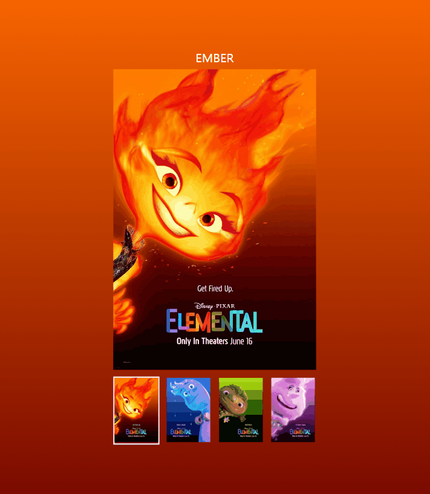

# Mission - 2

썸네일 이미지를 클릭하면 메인 이미지와 배경이 바뀔 수 있도록 코드 로직을 작성해주세요.

### 요구사항

1. 이벤트 처리 방식을 사용하여 클릭 이벤트를 걸어주세요.
2. 이미지와 색상의 데이터는 `data.js` 에서 불러와주세요.
3. 각 li 항목들을 클릭하면 배경 색상과 메인 비주얼 이미지를 변경해주세요.
4. 비주얼이 변경되면 상단에 비주얼에 맞는 이름으로 변경해주세요.
5. 함수를 분리시켜주세요.
   1. `setBgColor` 함수
   2. `setImage` 함수
   3. `setNameText` 함수
6. 가독성이 좋은 코드로 리팩토링 해주세요.

---

### 구현

```js
function el(selector) {
  return document.querySelector(selector);
}

const container = el(".container");
const ul = el("ul");
const body = el("body");
const visualImg = el(".visual img");
const nickName = el(".nickName");

const setImage = (e) => {
  let li = e.target.closest("li");
  if (!li) return;

  const list = [...ul.children];
  const index = li.getAttribute("data-index");
  let dataIndex = data[index - 1];
  let name = dataIndex.name;
  let alt = dataIndex.alt;
  let colorA = dataIndex.color[0];
  let colorB = dataIndex.color[1];

  list.forEach((li) => li.classList.remove("is-active"));
  li.classList.add("is-active");

  visualImg.setAttribute("src", `./assets/${name}.jpeg`);
  visualImg.setAttribute("alt", `${alt}`);

  setBgColor(colorA, colorB);

  setNameText(nickName, name);
};

const setBgColor = (colorA, colorB) => {
  body.style.background = `linear-gradient(to bottom, ${colorA}, ${colorB})`;
};

const setNameText = (target, name) => {
  target.textContent = name;
};

container.addEventListener("click", setImage);
```

### result


